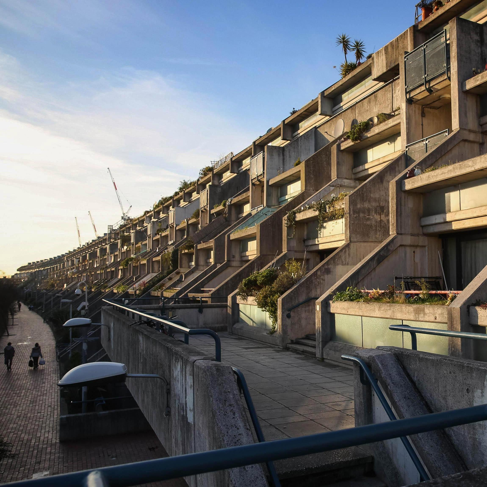
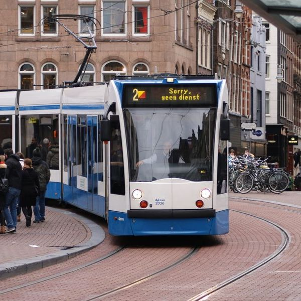
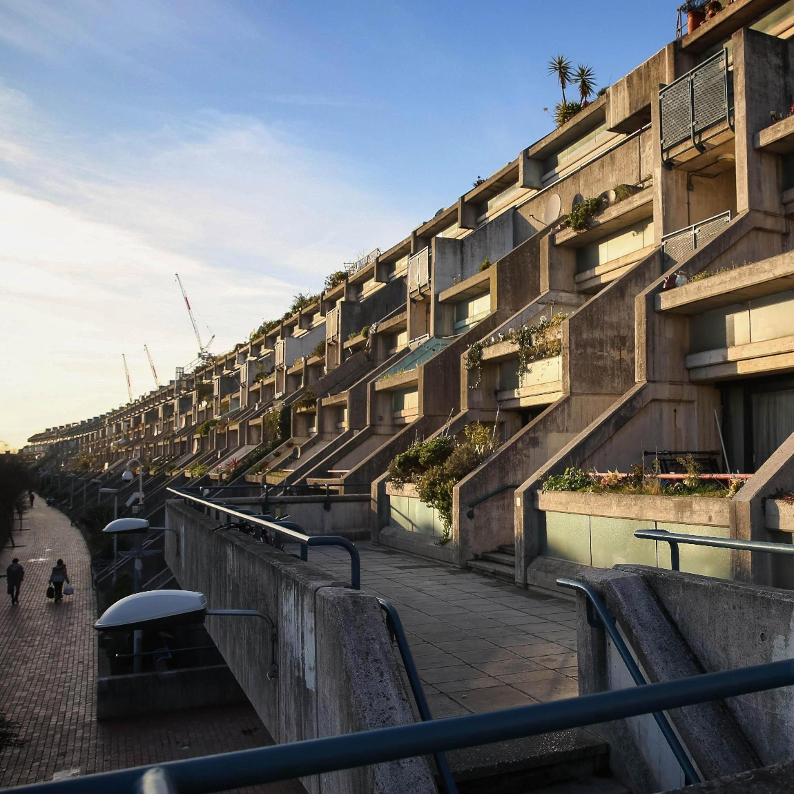
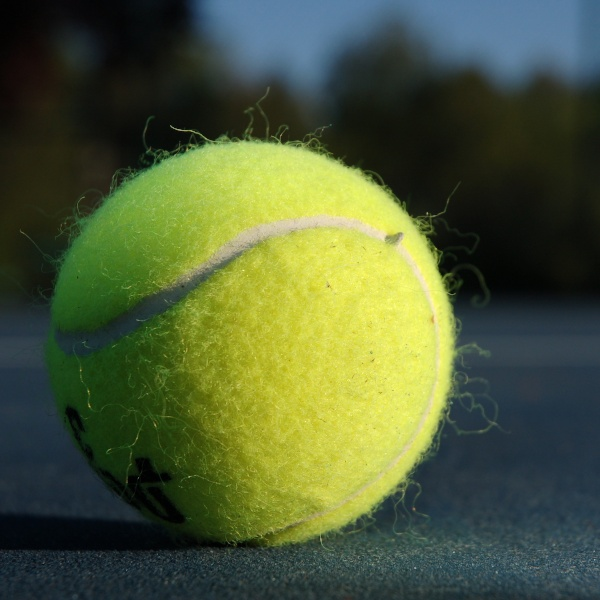
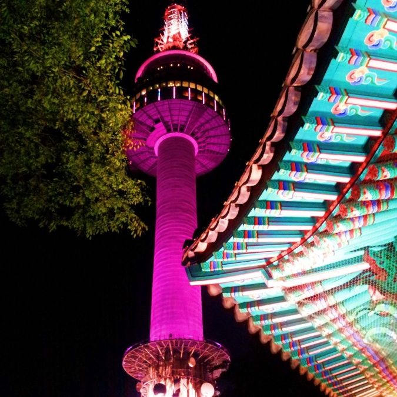
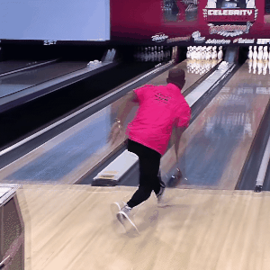
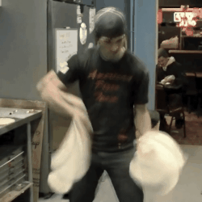

# Refining activation downsampling with SoftPool


--------------------------------------------------------------------------------
#### Update 10/2021:
We have extended this work with in our paper: ***AdaPool: Exponential Adaptive Pooling for Information-Retaining Downsampling***. Info, code and resources are available at [`alexandrosstergiou/adaPool`](https://github.com/alexandrosstergiou/adaPool)

## Abstract
Convolutional Neural Networks (CNNs) use pooling to decrease the size of activation maps. This process is crucial to increase the receptive fields and to reduce computational requirements of subsequent convolutions. An important feature of the pooling operation is the minimization of information loss, with respect to the initial activation maps, without a significant impact on the computation and memory overhead. To meet these requirements, we propose SoftPool: a fast and efficient method for exponentially weighted activation downsampling. Through experiments across a range of architectures and pooling methods, we demonstrate that SoftPool can retain more information in the reduced activation maps. This refined downsampling leads to improvements in a CNN's classification accuracy. Experiments with pooling layer substitutions on ImageNet1K show an increase in accuracy over both original architectures and other pooling methods. We also test SoftPool on video datasets for action recognition. Again, through the direct replacement of pooling layers, we observe consistent performance improvements while computational loads and memory requirements remain limited. <p align="center">

<i></i>
<br>
<i><p align="center"> To appear in <a href="http://iccv2021.thecvf.com/home"> IEEE International Conference on Computer Vision (ICCV) 2021</a></p></i>
<p align="center">
<a href="https://arxiv.org/abs/2101.00440" target="blank" >[arXiv preprint]</a>
&nbsp;&nbsp;&nbsp;
<a href="https://openaccess.thecvf.com/content/ICCV2021/html/Stergiou_Refining_Activation_Downsampling_With_SoftPool_ICCV_2021_paper.html" target="_blank">[CVF open access]</a>
&nbsp;&nbsp;&nbsp;
<a href="https://www.youtube.com/watch?v=iqsMoVQSyDw" target="blank" >[video presentation]</a>
</p>

Image based pooling. Images are sub-sampled in both height and width by half.

|Original|||||||
|:-----:|:-----:|:-----:|:-----:|:-----:|:-----:|:-----:|
|Soft Pool|||||||

Video based pooling. Videos are sub-sampled in time, height and width by half.


|Original|||||||
|:-----:|:-----:|:-----:|:-----:|:-----:|:-----:|:-----:|
|Soft Pool|||||||

## Dependencies
All parts of the code assume that `torch` is of version 1.4 or higher. There might be instability issues on previous versions.

> ***! Disclaimer:*** This repository is heavily structurally influenced on Ziteng Gao's LIP repo [https://github.com/sebgao/LIP](https://github.com/sebgao/LIP)

## Installation

You can build the repo through the following commands:
```
$ git clone https://github.com/alexandrosstergiou/SoftPool.git
$ cd SoftPool-master/pytorch
$ make install
--- (optional) ---
$ make test
```


## Usage

You can load any of the 1D, 2D or 3D variants after the installation with:

```python
import softpool_cuda
from SoftPool import soft_pool1d, SoftPool1d
from SoftPool import soft_pool2d, SoftPool2d
from SoftPool import soft_pool3d, SoftPool3d
```

+ `soft_poolxd`: Is a functional interface for SoftPool.
+ `SoftPoolxd`: Is the class-based version which created an object that can be referenced later in the code.

## ImageNet models

ImageNet weight can be downloaded from the following links:

|Network|link|
|:-----:|:--:|
| ResNet-18 | [link](https://drive.google.com/file/d/11me4z74Fp4FkGGv_WbMZRQxTr4YJxUHS/view?usp=sharing) |
| ResNet-34 | [link](https://drive.google.com/file/d/1-5O-r3hCJ7JSrrfVowrUZpaHcp7TcKKT/view?usp=sharing) |
| ResNet-50 | [link](https://drive.google.com/file/d/1HpBESqJ-QLO_O0pozgh1T3xp4n5MOQLU/view?usp=sharing) |
| ResNet-101 | [link](https://drive.google.com/file/d/1fng3DFm48W6h-qbFUk-IPZf9s8HsGbdw/view?usp=sharing) |
| ResNet-152 | [link](https://drive.google.com/file/d/1ejuMgP4DK9pFcVnu1TZo6TELPlrhHJC_/view?usp=sharing) |
| DenseNet-121 | [link](https://drive.google.com/file/d/1EXIbVI19JyEjgY75caZK2B2-gaxKTVpK/view?usp=sharing) |
| DenseNet-161 | [link](https://drive.google.com/file/d/18Qs9XUXNPSgBe46_0OGZIcpvdoFZfjU5/view?usp=sharing) |
| DenseNet-169 | [link](https://drive.google.com/file/d/1shFZV_AIZ6SQFQs-C0YThfpOfZH88hm7/view?usp=sharing) |
| ResNeXt-50_32x4d | [link](hhttps://drive.google.com/file/d/1-3sd8paTlqa1X8KGUy6B5Eehv791tbVH/view?usp=sharing) |
| ResNeXt-101_32x4d | [link](https://drive.google.com/file/d/1URDkwAPxDgcQzkYFlV_m-1T5RjZvzabo/view?usp=sharing) |
| wide-ResNet50 | [link](https://drive.google.com/file/d/1X3A6P0enEJYLeNmY0pUTXA26FEQB1qMe/view?usp=sharing) |

## Citation

```
@inproceedings{stergiou2021refining,
  title={Refining activation downsampling with SoftPool},
  author={Stergiou, Alexandros, Poppe, Ronald and Kalliatakis Grigorios},
  booktitle={International Conference on Computer Vision (ICCV)},
  year={2021},
  pages={10357-10366},
  organization={IEEE}
}
```

## Licence

MIT

## Additional resources
A great project is Ren Tianhe's [`pytorh-pooling` repo](https://github.com/rentainhe/pytorch-pooling) for overviewing different pooling strategies.
